

# triplet loss及可视化 #

***

## 1. hinge loss ##

$$ loss=max(0,s_j-s_{y_i}+\bigtriangleup) $$

特点：

最大化间隔

当其他类与真实类间隔大于$\bigtriangleup$时，没有损失

## 2. triplet loss ##

> 参考: A Unified Embedding for Face Recognition and Clustering

### 2.1 解决的问题 ###

* 建模时对细节进行区分

* 关注点从类别转变到不同类特征向量的差异

### 2.2 思想 ###
&emsp;&emsp;
在向量空间中，让具有相同标签的样本，encode之后的向量之间的距离变近。在向量空间里，让具有不同标签的样本之间的距离变远。采用了间隔最大化，自然而然的想起来SVM、hinge loss，找一个超平面将区分各个类别。__用的是什么距离__：欧氏距离。

&emsp;&emsp;
与hinge loss的区别，hinge loss 是在两个样本之间的距离。

### 2.3 实现 ###

&emsp;&emsp;
__问题1：__损失函数的基本形式

&emsp;&emsp;
让类别之间有margin, 基本形式

$$loss=max(0,s_j-s_{y_i}+\bigtriangleup)$$

&emsp;&emsp;
__问题2：__ 如何改造

&emsp;&emsp;
triplet loss让anchor样本与positive样本之间的距离，都小于和negative样本间的距离

即$distance(a, p)$ 总是大于 $distance(a, n)+\bigtriangleup$

$$triplet loss=max(0,distance(a, p)-distance(a, n)+\bigtriangleup)$$

其中：

a-anchor为当前样本

p-positive为与a相同类别的样本

n-negative为与a不同类别的样本

放到triplet loss里面

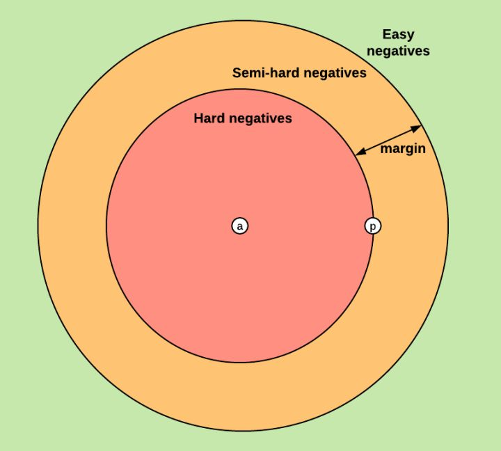

&emsp;&emsp;
__问题3：__ 如何构造训练集

&emsp;&emsp;
每个样本和batch里面所有其他的样本计算距离, 计算损失,复杂度$O(N*N)$, 实际上easy negatives不会影响训练, semi-hard negatives和hard negatives是优化的主要方向。

&emsp;&emsp;
__问题4__：如何应用到分类

&emsp;&emsp;
得到特征向量后，接分类器

&emsp;&emsp;
__做法1：__

&emsp;&emsp;
在batch上先计算所有样本之间的margin, 选出来hard和semi-hard样本，进行求解

即batch all，这种做法会关注所有样本，离群点也会有影响。

&emsp;&emsp;
__做法2：__

&emsp;&emsp;
选出来hardest positive, 针对这些难分的样例进行区分，对比SVM相当于只考虑支持向量，鲁棒性会强一点

数据表明，用batch hard 效果好

> 参考:In Defense of the Triplet Loss for Person Re-Identification

## 3 可视化 ##

__3.1 LSTM 激活可视化__

+ 使用Bi-LSTM训练模型, 字模型, 分别使用triplet loss、cross entropy loss、hinge loss训练模型

+ 可视化方式：LSTM在每个字符处的激活单元个数，激活个数为前向和后向之和

+ 激活的定义：LSTM各个门的结果大于0.8

+ 训练语料为导航和其他task, 二分类

+ margin为1

__为什么取0.8__:forget_gate、input_gate、output_gate由sigmoid激活。$x = 0.8$时,sigmoid为0.83, 可以认为是激活状态。

> 参考:Visualizing and undersranding recurrent networks

query:去安泰小区怎么走(依次为triplet loss, cross entropy、hinge loss)

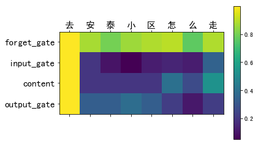

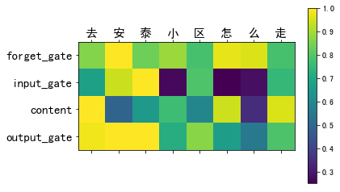

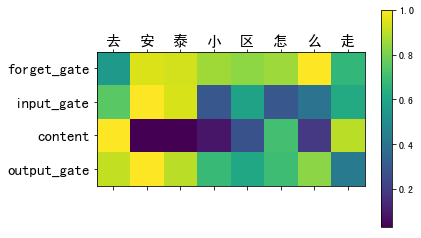

query:导航到高铁东站(依次为triplet loss, cross entropy、hinge loss)

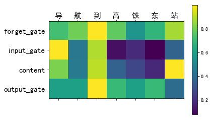

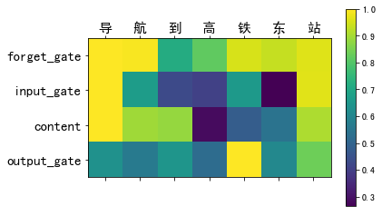

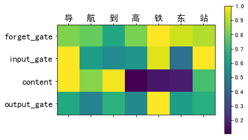

query:我要去南漳涌泉(依次为triplet loss, cross entropy、hinge loss)

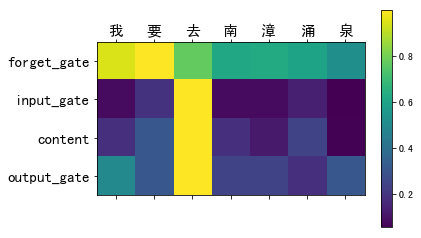

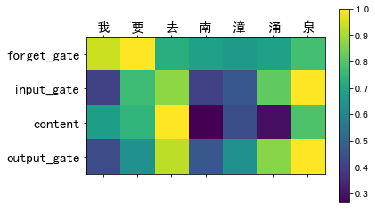

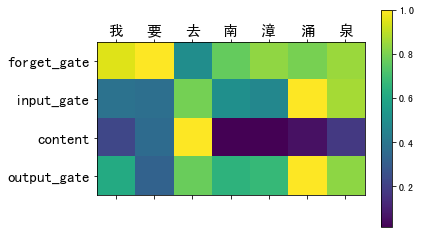

__结论:__

+ triplet loss 各个门对关键词似乎都比较敏感

+ cross entropy和hinge loss激活的gate相似

+ content 对cross entropy和hinge loss影响较大

__3.2 encoding可视化__

+ 提出Bi-LSTM的encode后的结果，采用PCA降维可视化

+ 数据来源：测试集中正负样本各抽取2000条

### triplet loss margin=100 ###

### triplet loss margin=1 ###

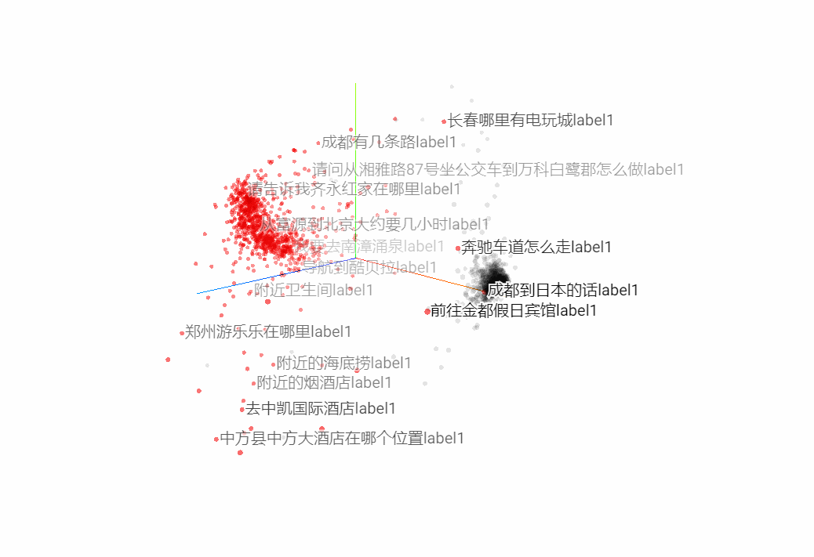

### softmax cross entropy ###

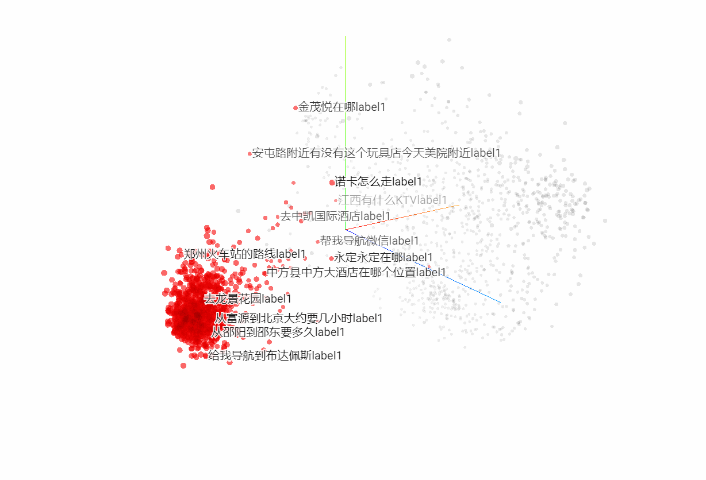

### hinge loss ###

__结论:__

+ triplet loss 更倾向于将各类聚到一起， margin越大，越集中

+ cross entropy 倾向于将一类聚到一起

+ hinge loss 两类都较为分散

__不足：__

&emsp;&emsp;

此处使用的是tf里面的hinge_loss，因为只支持0到1的score，只能用在softmax之后，且无法自定义margin

__3.3 softmax可视化__

+ 先用tiplet loss进行梯度下降，求解Bi-LSTM的参数，固定这些参数，再接全连接和softmax，训练求解全连接层的参数

+ 对softmax之前的结果进行可视化

+ 由于显示的关系，训练集和测试集各取400个样本

+ 将loss之前层的维度定义为2，进行降维

> 参考：Large-Margin Softmax Loss for Convolutional Neural Networks

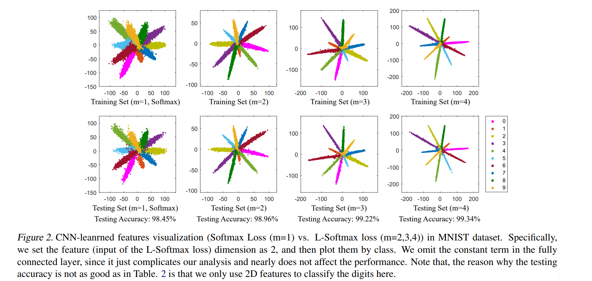

### triplet loss(margin=10) ###

__train__

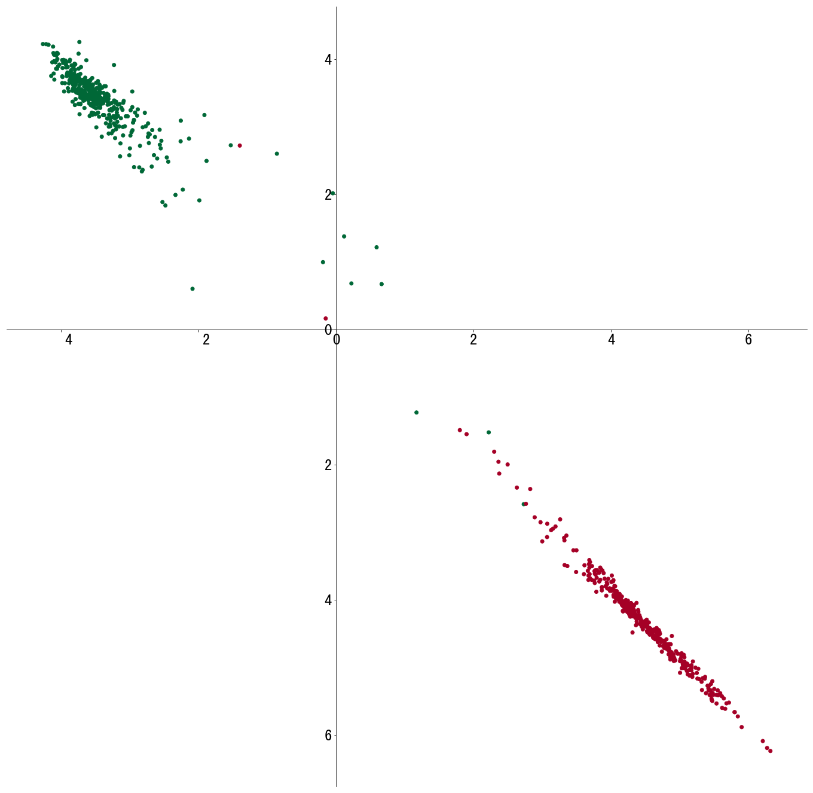

__test__

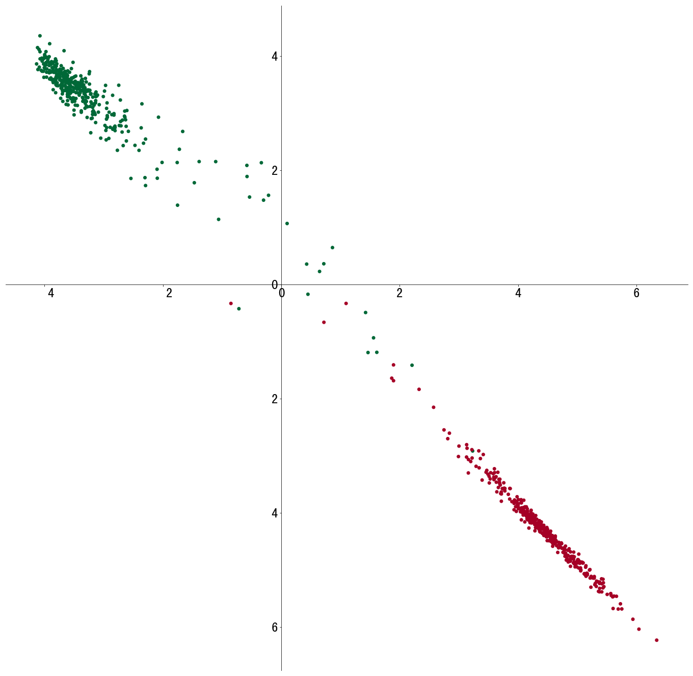

### softmax cross entropy ###

__train__

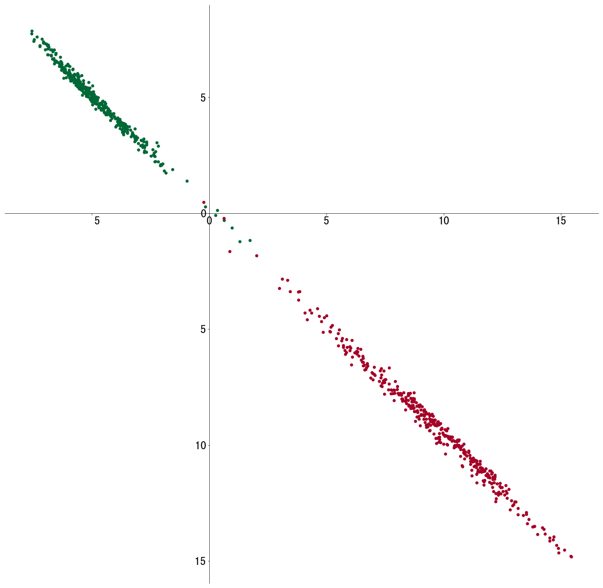

__test__

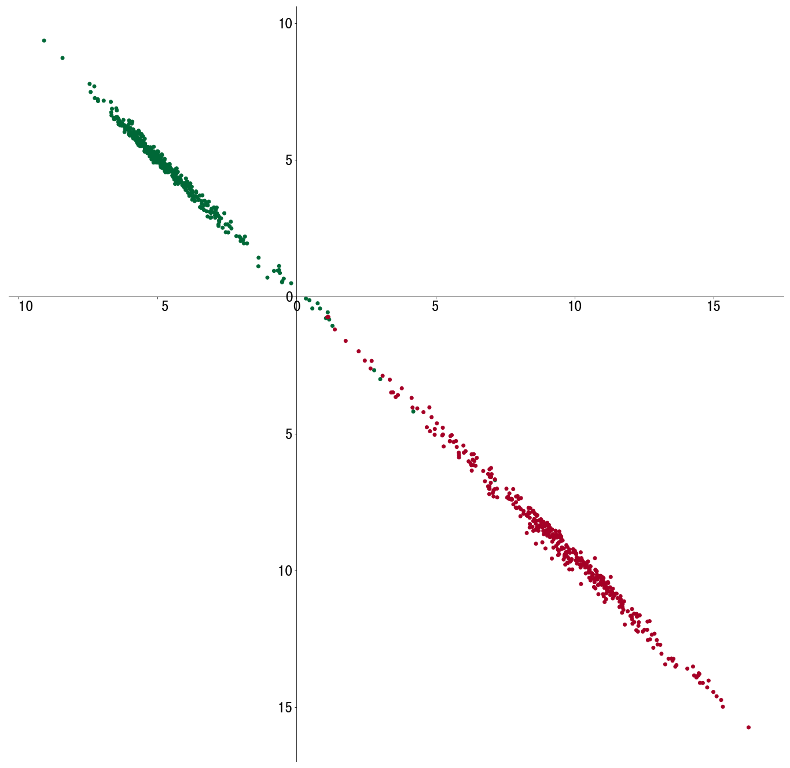

### hinge loss ###

__train__

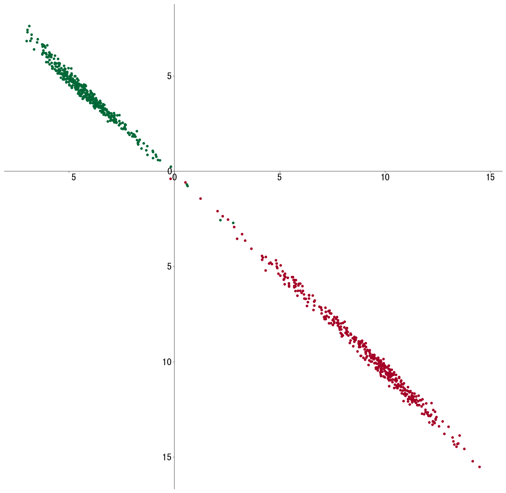

__test__

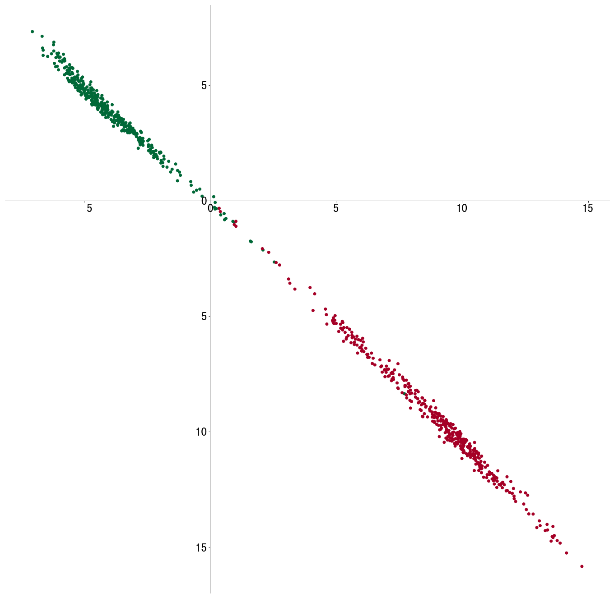

__结论:__

+ 三种模型softmax层基本都在$y=-x$这条线上，即分类最明显的地方，也解释了为什么模型训练出来，大部分score接近0.9或0.1

+ triplet loss有部分样本很分散，反映了其不容易收敛的特性

+ cross entropy 和 hinge loss 表现比较接近

