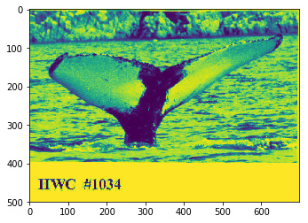
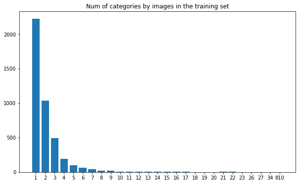
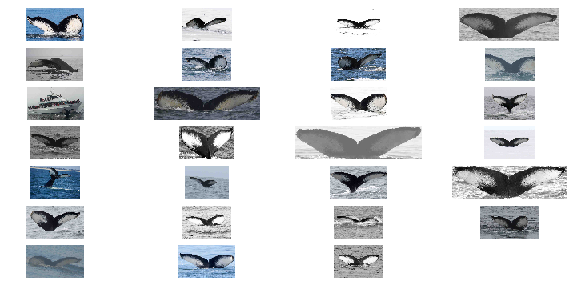
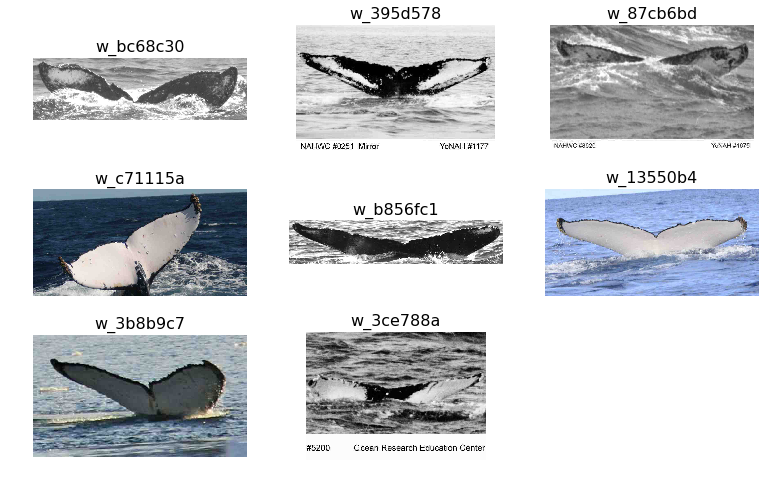
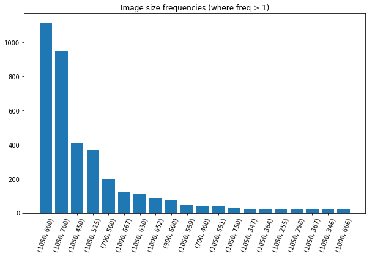
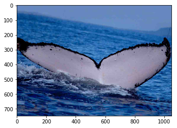
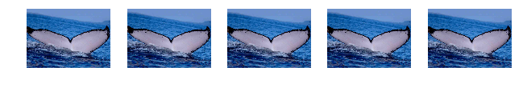
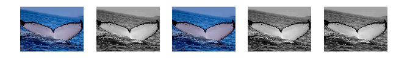

```python
import pandas as pd
import numpy as np
from PIL import Image
import matplotlib.pyplot as plt
from collections import Counter
INPUT_DIR = 'D:/tens/kraggle/whale/train/'

PATH = r"D:\tens\kraggle\whale\train.csv"
train_df = pd.read_csv(PATH)
```


```python
train_df.describe()
```


<div>
<style>
    .dataframe thead tr:only-child th {
        text-align: right;
    }

    .dataframe thead th {
        text-align: left;
    }

    .dataframe tbody tr th {
        vertical-align: top;
    }
</style>
<table border="1" class="dataframe">
  <thead>
    <tr style="text-align: right;">
      <th></th>
      <th>Image</th>
      <th>Id</th>
    </tr>
  </thead>
  <tbody>
    <tr>
      <th>count</th>
      <td>9850</td>
      <td>9850</td>
    </tr>
    <tr>
      <th>unique</th>
      <td>9850</td>
      <td>4251</td>
    </tr>
    <tr>
      <th>top</th>
      <td>72046206.jpg</td>
      <td>new_whale</td>
    </tr>
    <tr>
      <th>freq</th>
      <td>1</td>
      <td>810</td>
    </tr>
  </tbody>
</table>
</div>


```python
train_df.head()
```


<div>
<style>
    .dataframe thead tr:only-child th {
        text-align: right;
    }

    .dataframe thead th {
        text-align: left;
    }

    .dataframe tbody tr th {
        vertical-align: top;
    }
</style>
<table border="1" class="dataframe">
  <thead>
    <tr style="text-align: right;">
      <th></th>
      <th>Image</th>
      <th>Id</th>
    </tr>
  </thead>
  <tbody>
    <tr>
      <th>0</th>
      <td>00022e1a.jpg</td>
      <td>w_e15442c</td>
    </tr>
    <tr>
      <th>1</th>
      <td>000466c4.jpg</td>
      <td>w_1287fbc</td>
    </tr>
    <tr>
      <th>2</th>
      <td>00087b01.jpg</td>
      <td>w_da2efe0</td>
    </tr>
    <tr>
      <th>3</th>
      <td>001296d5.jpg</td>
      <td>w_19e5482</td>
    </tr>
    <tr>
      <th>4</th>
      <td>0014cfdf.jpg</td>
      <td>w_f22f3e3</td>
    </tr>
  </tbody>
</table>
</div>


```python
fig = plt.figure()
img = plt.imread(INPUT_DIR+train_df.Image[0])
plt.imshow(img)
plt.show()
```





```python
num_categories = len(train_df.Id.unique())
num_img = len(train_df.Id)
```


```python
size_buckets = Counter(train_df.Id.value_counts())
plt.figure(figsize=(10, 6))

plt.bar(range(len(size_buckets)), list(size_buckets.values())[::-1], align='center')
plt.xticks(range(len(size_buckets)), list(size_buckets.keys())[::-1])
plt.title("Num of categories by images in the training set")

plt.show()
```


    <matplotlib.figure.Figure at 0xb7cdef0>





```python
train_df['Id'].value_counts().head(3)
```


    new_whale    810
    w_1287fbc     34
    w_98baff9     27
    Name: Id, dtype: int64


```python
w_98baff9 = train_df[train_df['Id'] == 'w_98baff9']
plot_images_for_filenames(list(w_98baff9['Image']), None, rows=9)
plt.show()
```





```python
one_image_ids = train_df['Id'].value_counts().tail(8).keys()
one_image_filenames = []
labels = []
for i in one_image_ids:
    one_image_filenames.extend(list(train_df[train_df['Id'] == i]['Image']))
    labels.append(i)
    
plot_images_for_filenames(one_image_filenames, labels, rows=3)
plt.show()
```





```python
img_sizes = Counter([Image.open(f'{INPUT_DIR}{i}').size for i in train_df['Image']])

size, freq = zip(*Counter({i: v for i, v in img_sizes.items() if v > 1}).most_common(20))

plt.figure(figsize=(10, 6))

plt.bar(range(len(freq)), list(freq), align='center')
plt.xticks(range(len(size)), list(size), rotation=70)
plt.title("Image size frequencies (where freq > 1)")

plt.show()
```





```python
from keras.preprocessing.image import (
    random_rotation, random_shift, random_shear, random_zoom,
    random_channel_shift, transform_matrix_offset_center, img_to_array)
img = Image.open(f'{INPUT_DIR}ff38054f.jpg')
```


```python
img_arr = img_to_array(img)
plt.imshow(img)
imgs = [
    random_rotation(img_arr, 30, row_axis=0, col_axis=1, channel_axis=2, fill_mode='nearest') * 255
    for _ in range(5)]
img_max = np.array(imgs).max()
imgs = imgs/img_max
plot_images(imgs, None, rows=1)
plt.show()
```





```python
imgs = [
    random_shift(img_arr, wrg=0.1, hrg=0.3, row_axis=0, col_axis=1, channel_axis=2, fill_mode='nearest') * 255
    for _ in range(5)]

img_max = np.array(imgs).max()
imgs = imgs/img_max
plot_images(imgs, None, rows=1)
plt.show()
```


```python
imgs = [
    random_shear(img_arr, intensity=0.4, row_axis=0, col_axis=1, channel_axis=2, fill_mode='nearest') * 255
    for _ in range(5)]
img_max = np.array(imgs).max()
imgs = imgs/img_max
plot_images(imgs, None, rows=1)
plt.show()
```





```python
imgs = [
    random_zoom(img_arr, zoom_range=(1.5, 0.7), row_axis=0, col_axis=1, channel_axis=2, fill_mode='nearest') * 255
    for _ in range(5)]
img_max = np.array(imgs).max()
imgs = imgs/img_max
plot_images(imgs, None, rows=1)
plt.show()
```


```python
import random

def random_greyscale(img, p):
    if random.random() < p:
        return np.dot(img[...,:3], [0.299, 0.587, 0.114])
    
    return img

imgs = [
    random_greyscale(img_arr, 0.5) * 255
    for _ in range(5)]

plot_images(imgs, None, rows=1)
plt.show()
```




